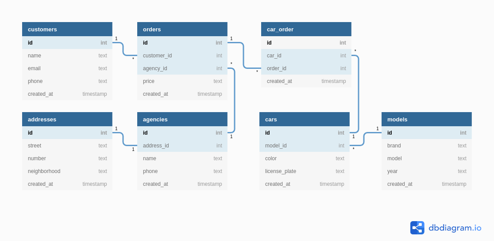
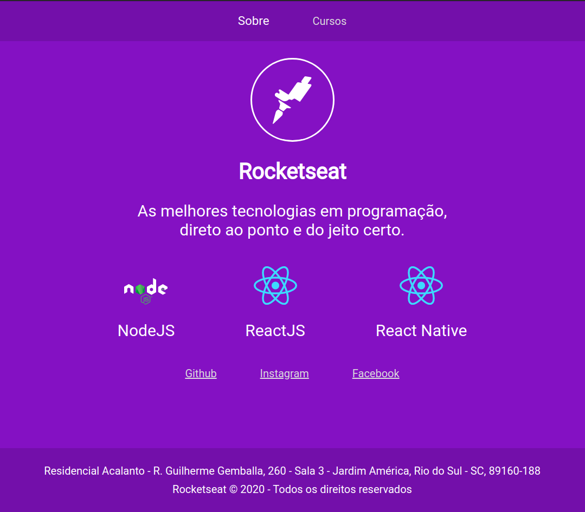

<h1 align="center">
    
</h1>

<h3 align="center">
  Resolução dos Desafios Módulo 6
</h3>

<p align="center">

  <a href="https://rocketseat.com.br">
    
  </a>

  <a href="https://github.com/diegyohoho/launchbase-04/blob/master/LICENSE" >
    
  </a>
  
  <a href="https://www.linkedin.com/in/diegyohoho/" >
    
  </a>

</p>

<p align="center">
  <a href="https://github.com/diegyohoho/launchbase-04">Início</a>&nbsp;&nbsp;&nbsp;|&nbsp;&nbsp;&nbsp;
  <a href="#desafios">Desafios</a>&nbsp;&nbsp;&nbsp;|&nbsp;&nbsp;&nbsp;
  <a href="#licença">Licença</a>
</p>

## Desafios
<a href="https://github.com/Rocketseat/bootcamp-launchbase-desafios-03/blob/master/desafios/03-1-primeiro-servidor.md">Descrição</a>
1. [x] [DBML](#dbml)
2. [x] [Footer](#footer)
3. [ ] [Funções assíncronas](#funções-assíncronas)
4. [ ] Máscaras

#### DBML
<h1 align="center">
    
</h1>

```
Table customers {
  id int [pk, increment]
  name text [not null]
  email text [not null]
  phone text [not null]
  created_at timestamp [default: `now()`]
}

Table agencies {
  id int [pk, increment]
  address_id int [not null]
  name text [not null]
  phone text [not null]
  created_at timestamp [default: `now()`]
}

Table addresses {
  id int [pk, increment]
  street text [not null]
  number text [not null]
  neighborhood text [not null]
  created_at timestamp [default: `now()`]
}

Table cars {
  id int [pk, increment]
  model_id int [not null]
  color text [not null]
  license_plate text [not null]
  created_at timestamp [default: `now()`]
}

Table models {
  id int [pk, increment]
  brand text [not null]
  model text [not null]
  year text [not null]
  created_at timestamp [default: `now()`]
}

Table orders {
  id int [pk, increment]
  customer_id int [not null]
  agency_id int [not null]
  price text [not null]
  created_at timestamp [default: `now()`]
}

Table car_order {
  id int [pk, increment]
  car_id int [not null]
  order_id int [not null]
  created_at timestamp [default: `now()`]
}

Ref: agencies.address_id - addresses.id
Ref: cars.model_id > models.id
Ref: orders.customer_id > customers.id
Ref: orders.agency_id > agencies.id
Ref: car_order.car_id > cars.id
Ref: car_order.order_id > orders.id
```

###### Código SQL [aqui](desafio-6/dbml.sql)!

#### Footer
<h1 align="center">
    
</h1>

###### Código [aqui](../../semana01/modulo03/desafio-3)!

#### Funções assíncronas

[Double](desafio-6/async/double/doubleTimeout.js)
 - [Callback](desafio-6/async/double/doubleCallback.js)
 - [Promise](desafio-6/async/double/doublePromise.js)
 - [Async/Await](desafio-6/async/double/doubleAsyncAwait.js)

## Licença

Esse projeto está sob a licença MIT. Veja o arquivo [LICENSE](https://github.com/diegyohoho/launchbase-04/blob/master/LICENSE) para mais detalhes.
